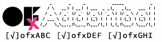
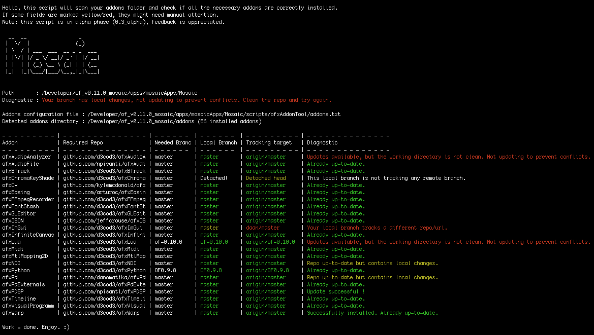

ofxAddonTool
============
  
Bash script for managing your OpenFrameworks addon dependencies using git using a project-specific configuration file.  
  

Introduction
------------
Working with several OpenFrameworks projects, each requiring specific versions of ofxAddons can be a headache. This script aims to simplify dependency installation, verification and updating.  

### How it works
It compares a configuration file (`addons.txt`) against the `openframeworks/addons` folder then runs some diagnostic checks and actions on them.

Current State
-------------
This tool is still under development (alpha). Basic functionality is there and remains to be tested on a wider set of configurations.
Any [feedback, suggestions or contributions](https://github.com/Daandelange/ofxAddonTool/issues) are welcome.

License
-------
MIT license. [Read license](./LICENSE.md).

Installation
------------
*Please, note that this is no OpenFrameworks addon, so don't install it in `path/to/of/addons`.*
To install this tool, the best way is to add it to your OpenFrameworks project **as a submodule**.
You're free to install it in the root of your project or in any subfolder. The script will fetch the first parent directory having a working git repository.
In the example below, we install it to the `scripts`.
````bash
cd /path/to/of/apps/myApps/exampleApp
mkdir scripts && cd ./scripts
git submodule add https://github.com/Daandelange/ofxAddonTool.git
````

If you want fancy ASCI art, install `toilet` or `figlet`. (optional)
- Mac : `brew install figlet`
- Linux : `apt install figlet`

Setup
-----
Edit `/path/to/ofxAddonTool/addons.txt` with your favourite text editor to suit the needs of your project.  
For each addon, you need to provide the title (folder name), the URL and the branch to checkout.  
Further instructions are within that file.  

Usage
-----
````bash
cd /path/to/of/apps/myApps/exampleApp/scripts/ofxAddonTool
./ofxAddonTool.sh --check
./ofxAddonTool.sh --help
````

Updating
--------
To get the latest version of this script.
````bash
# Get updates
cd /path/to/of/apps/myApps/exampleApp/scripts/ofxAddonTool
git checkout master && git pull

# Tell your project to use ofxAddonTool's latest commit (repo owners only)
cd /path/to/of/apps/myApps/exampleApp
git add /scripts/ofxAddonTool
git commit -m "Update submodule ofxAddonTool to latest version."
git push

# Synchronize all submodules of your project
git checkout master && git pull
git submodule update
````

Compatibility
-------------
This script is coded in pure Bash script. It runs on Linux and Mac. Windows is untested but should work.
An internet connection is recommended to get the latest remote updates.  
*Note: This script could easily be adapted as a git addon manager, without anything OpenFrameworks.*


Version history
---------------
See [CHANGELOG.md](./CHANGELOG.md).
